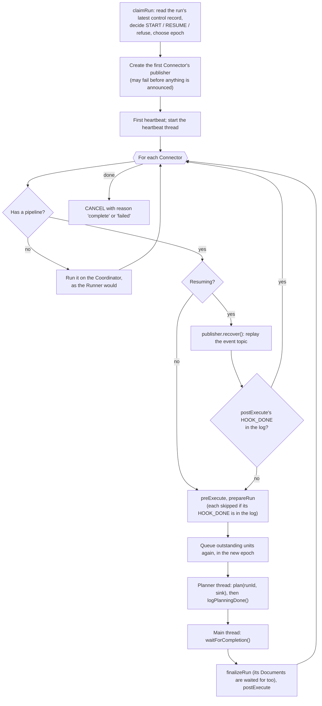
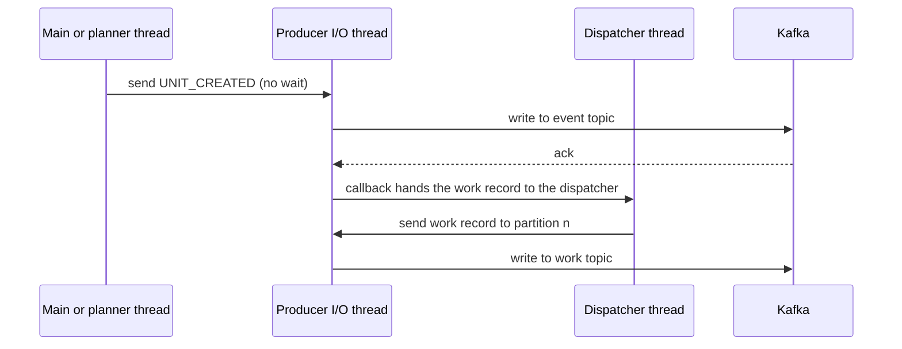

This page is for people changing the distributed crawl or writing a Connector or storage client for it. The design, and the reasons for it, are in [Distributing the Crawl]().

## Code map

All in `lucille-core`, under `com.kmwllc.lucille`.

| Class | Role |
|---|---|
| `core.CrawlCoordinator` | One run: claims it and its epoch, sends heartbeats, takes each Connector through its lifecycle, detects a stuck main loop, owns the source-concurrency controller. |
| `core.CoordinatorPublisher` | One Connector's state on the Coordinator: units queued, delayed, outstanding and done; partitions in use; Documents pending (inherited from `PublisherImpl`); the replay rules. |
| `core.SourceConcurrencyController` | The AIMD loop for `crawl.maxSourceConcurrency`. |
| `core.CrawlerPool`, `core.Crawler` | Crawler threads in one process; the watchdog and progress timers; executing and reporting one unit. |
| `core.CrawlerPublisher` | The `Publisher` a Connector is given on a Crawler: sends Documents, never blocks, aborts when the unit is no longer wanted. |
| `core.RunControlTracker` | A Crawler's view of every run's latest heartbeat, epoch, cancellation and source allowance. |
| `core.PartitionableConnector`, `core.UnitContext`, `core.WorkUnitSink`, `core.SingleUnitAdapter` | The Connector SPI. |
| `core.WorkUnit` | The unit record. |
| `core.FailureClass`, `core.SourceException` | Classifying a failure for the Coordinator. |
| `core.CrawlConfig` | The `crawl` block, topic creation, config hashing, run ID validation. |
| `message.CoordinatorMessenger`, `message.KafkaCoordinatorMessenger` | Logging and dispatching units, reading the event topic, reading an earlier run's costs. |
| `message.CrawlerMessenger`, `message.KafkaCrawlerMessenger` | Taking one unit from the work topic and holding it; sending Documents and Events. |
| `message.RunControl`, `message.KafkaRunControl`, `message.KafkaRunControlListener` | The control topic. |
| `message.LocalCrawlMessenger` | All three in memory, for tests. |
| `connector.FileConnector` | Planning by directory, executing units, budgets, hand-back grouping. |
| `connector.storageclient.TraversalBudget`, `SourceRetryPolicy`, `StorageClient.traverseAll` | The storage-client contract for bounded units and retries. |

## Records

### Work unit

`WorkUnit` is a Java record serialised as JSON. It is the value on the work topic (key: the unit ID) and the message of its `UNIT_CREATED` Event.

| Field | Meaning |
|---|---|
| `runId` | The run. Checked against `[A-Za-z0-9._-]{1,128}` before anything is sent on the unit's behalf. |
| `connectorName`, `pipelineName` | Which Connector in the Crawler's own config, and which pipeline its Documents go to. |
| `unitId` | `connectorName + "/" + key`. Stable across runs for the same part of the source. |
| `attempt` | The dispatch of this unit within the epoch; a report must name it. |
| `epoch` | The Coordinator that dispatched it. |
| `configHash` | SHA-256 of the Connector's config, with credential-like settings left out. |
| `payload` | The Connector's own description: for `FileConnector`, `path` or `paths`, and `recursive`. |

### Events

All on the run's event topic for the pipeline, `<pipeline>_event_<runId>` (`KafkaUtils.getEventTopicName`), one per pipeline per run, with one partition; `kafka.eventTopic`, if set, makes every run share that topic. The Event's document ID carries the unit ID, the Connector name, or the run ID; its message is JSON.

| Type | Sent by | Message |
|---|---|---|
| `UNIT_CREATED` | Coordinator, before dispatch | the `WorkUnit` |
| `UNIT_CHILDREN` | Crawler, before `UNIT_DONE` | `attempt`, `epoch`, `crawler`, `execution`, `children: [{key, payload}]`; a batch is closed at 200 entries or once it reaches 100,000 characters, so it can exceed that by one entry |
| `UNIT_PROGRESS` | Crawler, every heartbeat while a unit runs, when something changed | `attempt`, `epoch`, `crawler`, `execution`, `sourceCalls`, `refusedCalls`, `numPublished` (running totals) |
| `UNIT_DONE` | Crawler | `attempt`, `epoch`, `execution`, `crawler`, `numPublished`, `sourceCalls`, `refusedCalls`, `durationMs`, `numChildren`; `errorClass`, `errorCause` if the unit ended early because of its source |
| `UNIT_FAILED` | Crawler, its watchdog, or the Coordinator's messenger | Four forms. A unit that threw: as `UNIT_DONE` without children, plus `error`, `errorClass`, `errorCause`. The watchdog's timeout: `attempt`, `epoch`, `crawler`, `error`, `errorClass: TIMEOUT`. A unit abandoned because its run was orphaned: `attempt`, `epoch`, `crawler`, `error`, no `errorClass`. A failed dispatch: `attempt`, `epoch`, `crawler: "coordinator"`, `error`. The timeout and orphan forms count against `maxAttempts`. |
| `PLANNING_DONE` | Coordinator | none; the document ID is the Connector's name |
| `HOOK_DONE` | Coordinator | `preExecute`, `prepareRun`, `finalizeRun` or `postExecute` |
| `CREATE`, `FINISH`, `FAIL`, `DROP` | Crawler (`CREATE`), Indexer and Workers | as in every run mode |

`execution` is a UUID per execution of a unit. A unit delivered twice (after a rebalance, say) can be executing twice; its reports carry different executions and the Coordinator does not mix them.

### Control records

On the control topic, keyed by run ID, compacted with a seven-day retention:

| Type | Message |
|---|---|
| `HEARTBEAT` | `epoch`, `configHash`, `unitConcurrency` (absent when nothing bounds the source) |
| `CANCEL` | `epoch`, `configHash`, `reason` |

`KafkaRunControl` keeps a persistent reader of the topic and answers "latest record for a run" from it, taking the highest epoch seen. `KafkaRunControlListener` feeds the same records to each Crawler process's `RunControlTracker`. Records already in the topic when the listener starts are dated by their Kafka timestamp (or now, if earlier); later ones by when they arrive, so a heartbeat's age does not depend on the Coordinator's clock agreeing with the Crawler's. Every ten minutes the tracker forgets runs not heard from for 24 hours.

## The Coordinator

### A run



The heartbeat thread, every `heartbeatSecs`, in order: checks for a stuck main loop (below), checks whether a newer epoch or a cancellation has appeared (if so it fails the current publisher and stops), adjusts the source concurrency, and sends the heartbeat.

A Coordinator is **stuck** when `waitForCompletion` is running and its loop has not gone round for `orphanTimeoutSecs`. `PublisherImpl` calls `onWaitIteration()` at the top of each iteration; `CoordinatorPublisher` records the time. A stuck Coordinator stops heartbeating without cancelling and calls an exit action (`System.exit(1)` by default). Only the wait is watched: Connector lifecycle methods run on the same thread and may take as long as they need.

### A Connector's state

`CoordinatorPublisher` extends `PublisherImpl`, which already tracks pending Documents and runs the wait loop. It adds:

| State | Contents |
|---|---|
| `queuedUnits` | `PriorityQueue` of units waiting for a partition: by expected cost, descending, then insertion order. |
| `delayedUnits` | Units waiting out a backoff, with a due time. Moved to the queue when due. |
| `queuedUnitIds` | IDs of queued and delayed units, readable from any thread. |
| `queuedPlannedUnits` | Of those, the ones the planner emitted; `logPlanningDone` waits for this to empty. |
| `outstandingUnits` | Dispatched and not done, by unit ID, holding the current dispatch. |
| `unitPartitions`, `partitionBusy` | Which partition each dispatched unit is on. |
| `doneUnits` | Done unit IDs. |
| `handedBack` | `UNIT_CHILDREN` received, by unit and execution, until its `UNIT_DONE`. |
| `plainFailures`, `throttledFailures` | Per unit, counted against `maxAttempts` and `maxThrottledAttempts`. |
| `costOf`, `unitCosts` | Expected cost per unit; costs read from an earlier run. |

The Connector is complete when planning is done, `outstandingUnits` and `queuedUnitIds` are empty, and no Document is pending (`hasOutstandingWork()` and `numPending()`).

Three threads change this state: the planner, through the sink; the main thread, handling Events; and the heartbeat thread, which calls `setMaxUnitsInFlight` when the source concurrency changes (that dispatches queued units) and `fail` when it sees a newer epoch or a cancellation. `dispatchLock` guards the queue, delayed list and partitions; neither thread sends to Kafka while holding it. `dispatchWindow` is a separate monitor for waits (the planner when the queue is full, `logPlanningDone`), never held together with `dispatchLock`.

### Dispatch

```java
// CoordinatorPublisher.dispatchQueuedUnits(), in outline
List<Dispatch> ready;
synchronized (dispatchLock) {
  queueDueUnits();                                     // delayed units whose time has come
  while (no failure && queue not empty && dispatchWindowOpen()) {
    int partition = nextFreePartition();               // -1 if every partition is busy
    if (partition < 0) break;
    unit = queue.poll();
    mark outstanding; record its partition; mark the partition busy;
    ready.add(unit, partition);
  }
}
for (each ready) messenger.logAndDispatchUnit(UNIT_CREATED event, unit, partition);   // outside the lock
```

`dispatchWindowOpen()` is: outstanding units below `min(maxOutstandingUnits, units allowed by the source concurrency)`, and pending Documents below `publisher.maxPendingDocs` if set. `nextFreePartition()` walks the partitions in `CrawlConfig.interleavedPartitionOrder(n)`, a bit-reversed order that visits partitions far apart first, because Kafka assigns each consumer a run of neighbouring partitions; it carries on from wherever the last dispatch went.

The planner is held back too: `emit` waits while `MAX_QUEUED_UNITS` (100,000) units are queued or delayed, so a planner far ahead of the Crawlers does not fill the Coordinator's memory.

`dispatchQueuedUnits()` runs after every unit done or failed, from the sink after each planned unit, when the source concurrency changes, and at every iteration of the wait loop (which is at most the event poll timeout, two seconds), so a delayed unit is dispatched within one iteration of falling due and a Document finishing can reopen the window.

### Handling reports

A report counts only if it names the current dispatch of an outstanding unit: same unit ID, `attempt` and `epoch` (`outstandingUnitFor`). Anything else (a report on an earlier attempt, from a superseded Coordinator's dispatch, about a unit already done) is ignored, and so never frees a partition that another dispatch is using.

**`UNIT_DONE`:**

1. Take the `UNIT_CHILDREN` of this execution. If their number differs from `numChildren`, treat the unit as failed.
2. If one of the children is the unit itself, the unit could not list its own directory. Treat it as a failure of the class it reported (a source class if it gave one, else `SOURCE_ERROR`), not as done.
3. Otherwise mark it done, free its partition, and create a unit for each child that is not already known (outstanding, queued, delayed or done). If the unit ended early because of its source (`errorClass` THROTTLED or SOURCE_UNAVAILABLE), the children inherit its refusal count plus one and are delayed by the backoff for that count; at `maxThrottledAttempts` the run fails instead.

**`UNIT_FAILED`:** free the partition; count it as throttled if `errorClass` is THROTTLED or SOURCE_UNAVAILABLE, plain otherwise; fail the Connector at the relevant limit; otherwise queue the next attempt, delayed by `backoffMillis(count)` if throttled.

Backoff for the *n*th throttled failure: a ceiling of `min(throttleBackoffCapSecs, throttleBackoffSecs × 2^(n-1))`, and a wait chosen uniformly between half the ceiling and the ceiling.

**`UNIT_PROGRESS`:** the running total of refused calls for that unit and execution is compared with the last total seen, and only the increase is counted, so a refusal reported in progress and again in the final report is counted once.

### Replay

`recover()` reads the event topic from the beginning to the end offset it had when the messenger was created, and handles each Event with `replaying` set. The rules:

| Event | While replaying |
|---|---|
| `UNIT_CREATED` | The unit becomes outstanding (the newest dispatch by epoch, then attempt, wins). |
| `UNIT_CHILDREN`, `UNIT_DONE` | As live: the unit is done, and its children become outstanding, with epoch 0 so that a later logged dispatch of them replaces them and reports on that dispatch are accepted. |
| `UNIT_FAILED` | Ignored: the earlier Coordinator responded to it, and any re-dispatch is in the log. The unit stays outstanding. |
| `PLANNING_DONE`, `HOOK_DONE` | Recorded. (Live, these are the Coordinator's own Events coming back, and are ignored.) |
| `UNIT_PROGRESS` | Ignored; refusals are not counted, so a resumed run does not cut its source concurrency for what an earlier Coordinator saw. |
| `CREATE`, `FINISH`, ... | As live: pending Documents are rebuilt. |

Children are derived from the parent's report rather than from their own `UNIT_CREATED`, because the Coordinator may have died between receiving the report and dispatching them. After replay, the publisher queues every outstanding unit as attempt 1 of the new epoch. Its cost then comes only from `-costsFrom`: a cost hint the planner gave is not in the log, so it is lost for a unit dispatched again on resume.

Failure counts and delays are not in the log and start afresh on resume.

A Crawler's `UNIT_FAILED` for an orphaned run is meant for a Coordinator that is alive but whose heartbeats are late: it dispatches the unit again. Having no `errorClass`, it counts against `maxAttempts`. A Coordinator that resumes ignores it in replay, like any `UNIT_FAILED`.

### The Kafka messenger

`KafkaCoordinatorMessenger.logAndDispatchUnit` keeps the order "Event before unit" without waiting for either send:



The unit is sent from a single dispatcher thread rather than from inside the producer callback. A callback runs on the producer's I/O thread, and a send that needs a metadata refresh (the producer drops a topic it has not sent to for `metadata.max.idle.ms`, five minutes by default) waits for work only that thread can do: the send deadlocks until `max.block.ms`. Bounded runs, which dispatch handed-back units minutes apart, met exactly that.

If either send fails, the messenger puts a `UNIT_FAILED` Event for that dispatch (same attempt and epoch) on a local queue that `pollEvent()` returns before anything from Kafka. The Coordinator then retries the unit as it would after a Crawler's failure. `flush()` flushes the producer, waits for the dispatcher to drain, and flushes again, so every unit sent before it is accepted when it returns.

`readUnitCosts(runId, pipeline)` reads an earlier run's event topic with an ungrouped consumer (which may not auto-create topics), from its beginning to its end offset, and keeps the largest `sourceCalls` reported per unit ID. A run with no event topic gives no costs.

## The Crawler

### Taking a unit

`KafkaCrawlerMessenger` consumes the work topic with `max.poll.records=1` and the cooperative sticky assignor, in the group `crawl.consumerGroupId`. When it returns a unit it **pauses** its partitions and holds the record uncommitted. A paused consumer must still be polled to stay in the group, so a keep-alive thread polls it every second while a unit is held. When the unit is acknowledged, its offset is committed and the partitions resumed.

If a rebalance takes away the partition of the held unit, the unit is marked lost. `CrawlerPublisher` notices at its next publish and throws; the Crawler reports nothing (the new owner will execute it) and does not commit.

### Executing a unit

`Crawler.handleUnit`:

1. Discard (acknowledge without reporting) a unit whose run ID is malformed or whose pipeline is not in this Crawler's config.
2. Ask `RunControlTracker` for a decision on the unit's run and epoch, waiting up to `min(orphanTimeoutSecs, 3 × heartbeatSecs)` for a first heartbeat. `STALE` (older epoch), `CANCELLED`, `ORPHANED` (heartbeat too old) or `UNKNOWN` (never heard of): abandon. Only an orphaned run gets a `UNIT_FAILED` (see [Replay](#replay)).
3. Find the Connector in its own config (cached across units) and check its config hash against the unit's. A mismatch fails the unit as a `CONNECTOR_ERROR`, so it fails the run after `maxAttempts`.
4. Execute: `connector.executeUnit(unit, publisher, execution)`, then flush the publisher. Any `Throwable` is caught and reported; a `VirtualMachineError` is reported and then rethrown.
5. Report: `UNIT_CHILDREN` batches and `UNIT_DONE`, or `UNIT_FAILED` with `FailureClass.of(t)` and the root cause. Each report is sent, flushed and acknowledged by Kafka before the next step.
6. Acknowledge: commit the offset.

`CrawlerPublisher` sends each Document to the source topic and, once Kafka accepts it, its `CREATE` Event, so the Coordinator never tracks a Document that was not written. Before each publish it checks the run is still worth working for (`RunControlTracker`) and that the unit is not lost; otherwise it throws and records why, and the Crawler checks that record after the Connector returns, in case the Connector caught the exception.

`Execution` is the `UnitContext` for one execution: it collects handed-back parts, counts source calls and refusals, holds any source error, answers `maxSourceConcurrency()` from the tracker, and reports `isCancelled()` once the unit has timed out, been lost, or lost its run.

### Timers

`CrawlerPool` runs two scheduled threads:

- **Progress**, every `heartbeatSecs`: for each Crawler with a unit executing, send `UNIT_PROGRESS` if its totals changed since the last report.
- **Watchdog**, every 500 ms, only with `maxUnitSecs` set: a unit executing longer is reported `UNIT_FAILED` with class `TIMEOUT`, acknowledged, and the Crawler's messenger closed, which leaves the group and frees its partitions. The Crawler's thread is left to finish or not; a new Crawler is started in its place. With `exitOnTimeout`, the pool stops its other Crawlers, gives them ten seconds to finish and leave, and exits instead.

## The Connector SPI

```java
public interface PartitionableConnector extends Connector {
  default boolean isPartitioningEnabled() { ... }
  default void prepareRun(String runId) throws ConnectorException {}
  void plan(String runId, WorkUnitSink sink) throws ConnectorException;
  void executeUnit(WorkUnit unit, Publisher publisher, UnitContext context) throws ConnectorException;
  default void finalizeRun(String runId, Publisher publisher) throws ConnectorException {}
}

public interface WorkUnitSink {
  void emit(String unitKey, ObjectNode payload) throws ConnectorException;
  default void emit(String unitKey, ObjectNode payload, long costHint) throws ConnectorException;
}

public interface UnitContext {
  void handBack(String unitKey, ObjectNode payload);
  void addSourceCalls(long calls);
  default void addRefusedCalls(long calls) {}
  default void recordSourceError(FailureClass failureClass, String cause) {}
  default Integer maxSourceConcurrency() { return null; }
  default boolean isCancelled() { return false; }
}
```

Rules for an implementation:

- **Keys are stable.** The same part of the source must get the same key every time it is planned or handed back. That is how a resumed planner skips what exists, and how a part handed back twice is created once.
- **Executing a unit twice publishes the same Document IDs.**
- **Validate the payload.** Units arrive over the network; accept only parts of what this Connector was configured to read.
- **Hand back, don't do, what you hand back.** A handed-back part is executed by whoever receives it.
- **Count calls and refusals as they happen**, through the context, so progress reports carry them.
- A Connector that is not partitionable runs through `SingleUnitAdapter` as one unit calling `execute()`.

### FileConnector

- **Planning:** `depth` levels below each path, one recursive unit per directory at that level (key: its URI) and one non-recursive unit per directory above it (key: URI + `#files`). `depth: 0` plans each path as one unit. Local and S3 are split; other providers are one unit per path.
- **Payload:** `path` or `paths` (a group), and `recursive`. Every path is checked to lie within a configured path (for local paths, by real path, so a symbolic link cannot lead out) and not under `pathsToSkip`.
- **Execution:** one `TraversalBudget` per unit, from `maxDirectoriesPerUnit` and `maxUnitSecs`, with the context's `isCancelled` and `maxSourceConcurrency`, and a listener that adds each listing and refusal to the context. The unit's paths are grouped by storage client and each group passed to `traverseAll`.
- **Hand-back:** the budget's handed-back directories, in groups of `handBackGroupSize`. A single directory gets the key the planner would give it; a group gets `firstPath + "+" + (n-1) + suffix + "~" + hash`, where the suffix is `#files` for a non-recursive group and empty otherwise. A unit's own directory handed back because it could not be listed keeps the unit's kind: a non-recursive unit hands back `path#files`, non-recursive.

## The storage-client contract

A storage client takes part in bounded units and retries through what `TraversalParams` carries.

```java
TraversalBudget budget = params.getBudget();          // null outside a distributed unit
SourceRetryPolicy retry = params.getRetryPolicy();    // from sourceRetrySecs, sourceRetryCapSecs
```

| Call | When |
|---|---|
| `budget.mayList()` | Before listing a directory. False: do not list it; `budget.handBack(uri)`. It is true for the first directory whatever the limits, and false for everything once cancelled or once a source error is recorded. |
| `budget.callRefused()` | Each request refused for load (`THROTTLED`) or unanswered (`SOURCE_UNAVAILABLE`), retried or not. Not for access denied or not found, which are not a sign to slow down. |
| `retry.nextWaitMillis(n, firstFailureMillis)` | Before the *n*th retry; -1 means give up. Wait in slices that check `budget.isCancelled()`. |
| `budget.sourceError(class, e)`, `budget.listingFailed()`, `budget.handBack(uri)` | When a directory's listing is given up on. The traversal then returns instead of throwing; everything not yet listed is handed back as the traversal reaches it. |
| `budget.getMaxConcurrency()` | A client listing with a pool: the most listings this unit may have in flight, re-read between listings. |
| `traverseAll(publisher, params, stateMgr)` | Walk all of a unit's paths at once. The default walks them one after another; a client with a pool should make each path a root task of one pool. |

None of Lucille's built-in storage clients walks with a pool: the default `traverseAll` is a loop, and nothing built in reads `getMaxConcurrency()`. Both are hooks for a client that does.

Classify with care: only overload (`THROTTLED`, `SOURCE_UNAVAILABLE`) is retried. A client-side SDK failure is `SOURCE_UNAVAILABLE` only when an `IOException` lies beneath it; a credentials or signing failure would not pass if retried. Turn the SDK's own retries off when the policy is on, so every refusal is counted.

`S3StorageClient` is the reference: a stack-based walk under a budget, a retrying `listPrefix` and `getWithRetry`, and `classify(SdkException)`. `LocalStorageClient` honours the budget in `preVisitDirectory` and hands back a directory it cannot open.

## Source concurrency

`SourceConcurrencyController.adjust(refused)` runs once per heartbeat while units are in flight, with the refusals counted since the last heartbeat:

- some refused, and not at the floor (one call), and no cut within `sourceConcurrencyHoldSecs`: halve;
- some refused within the hold: keep;
- none refused: add `sourceConcurrencyStep`, up to `maxSourceConcurrency`.

The Coordinator then bounds units in flight at `min(partitions, figure)`, and the heartbeat carries `figure / min(partitions, figure)` (at least 1) as `unitConcurrency`, so the per-unit share is 1 whenever the figure is at most the number of partitions. An interval with no unit running is not counted as clean. The run's total of refusals is summed across Connectors under a lock, so the switch from one Connector's publisher to the next does not count one Connector's refusals twice.

## Tests

| Test | Covers |
|---|---|
| `CoordinatorPublisherTest` | Dispatch order and pacing, partitions, hand-back, children accounting, backoff with an injected clock, attempt limits, replay rules, progress deltas, self-hand-back. |
| `DistributedCrawlTest` | End to end in memory (`LocalCrawlMessenger`): failures, hangs and the watchdog, stuck Coordinator, resume, throttled units, source concurrency against a fake limited source. |
| `KafkaDistributedCrawlTest` | End to end on an embedded broker: dispatch after the work topic has been idle, resume after the Coordinator dies, unit costs, allowances in heartbeats, FileConnector hand-back on a temporary tree. |
| `KafkaCoordinatorMessengerTest` | Event-before-unit order, dispatch failures reported as unit failures, flush, with a `MockProducer`. |
| `S3StorageClientTest`, `LocalStorageClientTest`, `TraversalBudgetTest`, `SourceRetryPolicyTest`, `FailureClassTest`, `SourceConcurrencyControllerTest` | Budgets, retries (including a failure part way through a paged listing), classification, the controller. |
| `PartitionedFileConnectorTest` | Planning, every file published exactly once under any cut, grouped hand-back, unreadable directories, path validation. |

The scripted test Connector `ScriptedPartitionedConnector` can fail, hang, hand back, report throttling and call a fake source with a concurrency limit, on named units. Beyond unit tests, the crawl has been exercised against a three-broker Kafka cluster and on Kubernetes, with a throttling HTTP proxy in front of an S3-compatible store to inject refusal bursts, concurrency limits and outages, and with Coordinator and Crawler processes killed and suspended mid-run.
