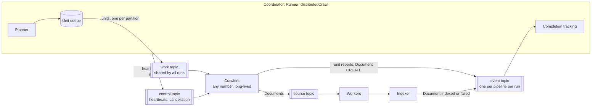
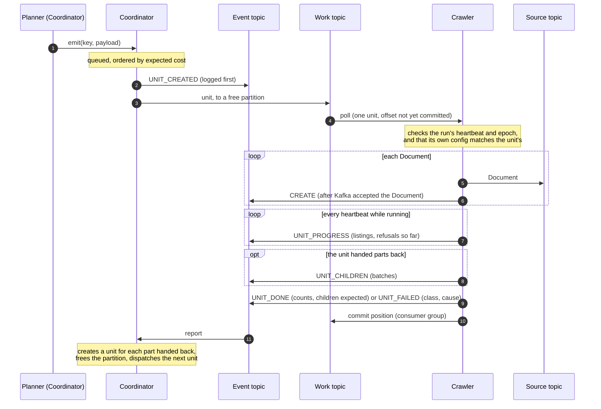
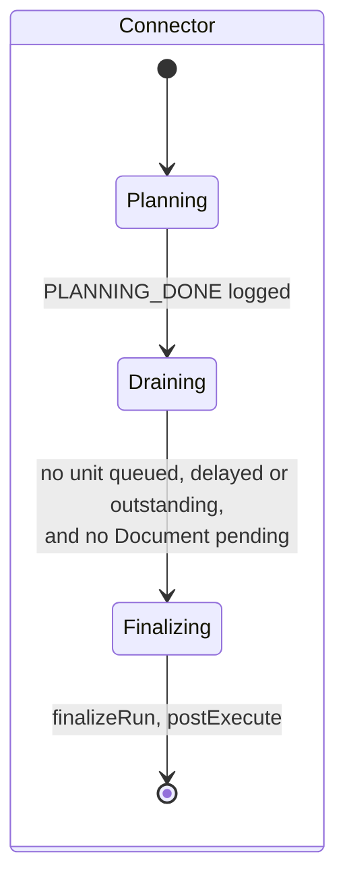
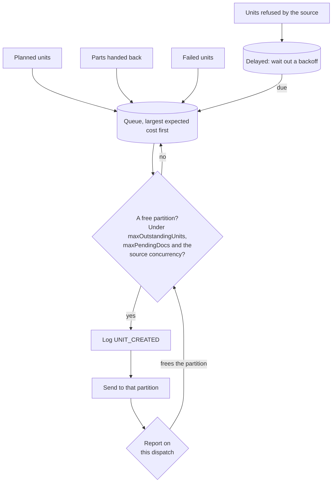
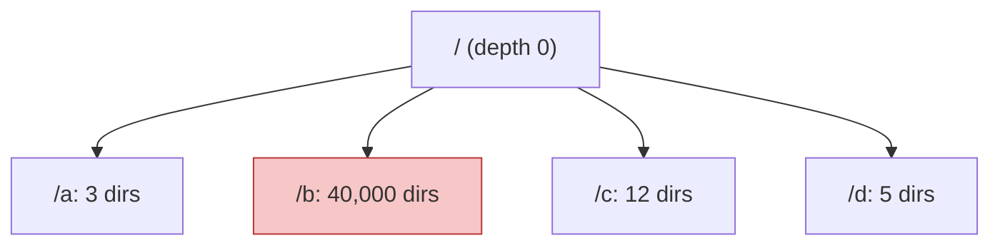
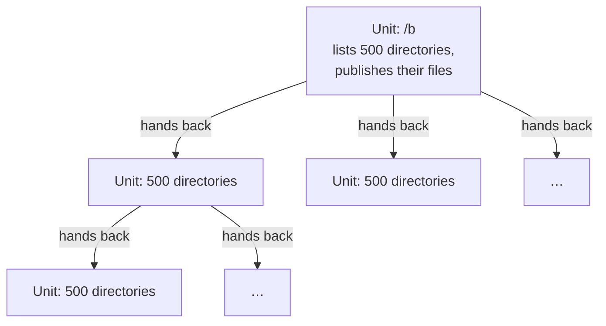
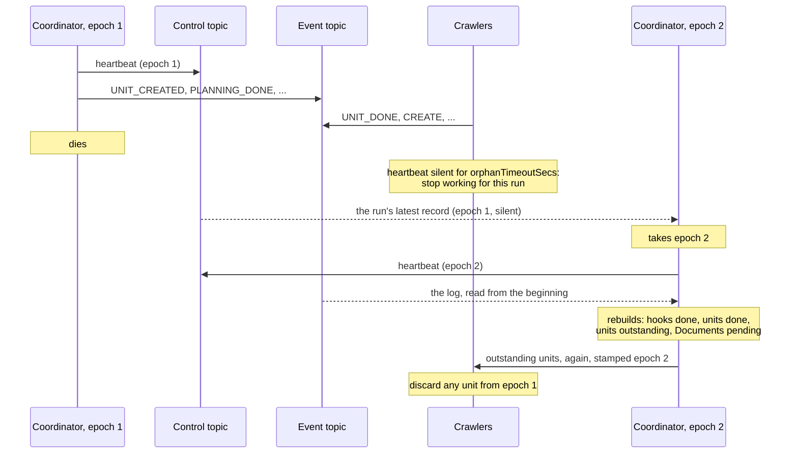
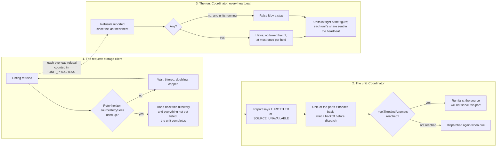

The [previous page]() showed how Workers and Indexers can run as separate processes that communicate through Kafka. One thing still happens in a single place in that arrangement: each Connector executes on one thread, inside the Runner. For a source that is slow to read, such as a large bucket whose every prefix has to be listed, that thread limits the whole run however many Workers are waiting.

A **distributed crawl** removes that limit. The Runner no longer executes Connectors; it becomes a **Coordinator** that cuts each Connector's work into **work units**, and separately deployed **Crawler** processes execute them.

This page describes the design. [Running a Distributed Crawl]() covers configuration, sizing, security and operation, and [Distributed Crawl Internals]() covers the implementation.

## Components

| Role | Started with | What it does |
|---|---|---|
| **Coordinator** | `Runner -distributedCrawl` | Owns one run. For each Connector in turn: calls its lifecycle methods, has it plan its units, dispatches them, and waits until every unit is done and every Document is indexed. Writes everything it decides to the run's event topic first, so that another Coordinator can take the run over. |
| **Crawler** | `com.kmwllc.lucille.core.Crawler` | Stays up across runs. Takes a unit from the work topic, builds the Connector the unit names from its *own* copy of the config, has it publish the unit's Documents, and reports the outcome. |
| **Worker, Indexer** | as in distributed mode | Unchanged. They cannot tell whether a Document was published by a Runner or a Crawler. |

A run is still a sequence of Connectors, each finishing before the next begins, and the run still stops if a Connector fails.

The three topics carry different things and have different lifetimes:

- The **work topic** is shared by every run. A unit on it is a small JSON record that says *where* to read (a path, a range), never which class to run or how it is configured. Each partition is read by one Crawler thread at a time.
- Each run has its own **event topic** for each pipeline, `<pipeline>_event_<runId>`, with one partition so that its Events stay in order. (Setting `kafka.eventTopic` makes every run share that one topic.) It is the run's write-ahead log: units created, Documents created and indexed, units done or failed, lifecycle steps completed.
- The **control topic** is compacted and keyed by run ID. The Coordinator's heartbeat goes there, with its **epoch** (which Coordinator of the run this is) and each unit's share of the source's capacity. A cancellation goes there too.

## Work units

A Connector that can be split implements `PartitionableConnector`: it **plans** units (`plan`) and **executes** one (`executeUnit`). Lifecycle work that needs the whole run, such as preparing a state database or expiring files no unit saw, stays on the Coordinator (`prepareRun`, `finalizeRun`).

| Connector | A unit is |
|---|---|
| `FileConnector` | A directory (local) or key prefix (S3) to walk recursively; the files directly in one directory; or, once directories have been handed back, a group of directories |
| `SequenceConnector` | A range of the sequence |
| Any other Connector, or one of these without a `partitioning` block | The whole Connector, run on one Crawler through its ordinary `execute()` |

A unit's ID is the Connector's name and a key the Connector chooses, such as the directory's URI. The same part of the source always gets the same key, which is how a resumed run recognises the units it has already created.

## The life of a unit

The unit is **logged before it is dispatched**. If the Coordinator dies between the two, its successor finds the unit in the log, not done, and dispatches it. In the other order a unit could be executing that no log knows of.

The Crawler **commits its position on the work topic only after reporting**. A Crawler that dies mid-unit never commits, and Kafka delivers the unit to another Crawler.

## Knowing when the run is complete

In the other run modes the Runner publishes every Document itself and so knows what to wait for. The Coordinator publishes nothing; it learns everything from the event topic:

- A Document is **pending** from its `CREATE` Event, sent by the Crawler once Kafka has accepted the Document, until the Indexer reports it indexed or failed. This is the same tracking the Runner already does for child Documents that a pipeline creates.
- A unit is **outstanding** from `UNIT_CREATED` until its `UNIT_DONE`. A `UNIT_DONE` names how many parts the unit handed back; if fewer arrived in `UNIT_CHILDREN`, the unit is treated as failed, since creating units for only some of them would leave part of the source uncrawled without anyone knowing.
- Planning is recorded as done only once **every planned unit has been dispatched**, and so logged. A Coordinator that died after recording planning done with planned units still in its queue would otherwise leave a successor that never plans them.

## How units are dispatched

Three rules decide what runs when.

**One unit in flight per partition.** A partition is read by one Crawler thread, in order, so a second unit sent to a busy partition waits behind the first however many Crawlers are idle. The Coordinator therefore keeps units in its own queue and sends each to whichever partition frees first. Nothing waits behind a long unit, provided there are at least as many Crawler threads as partitions; [the operations page]() says how to size them.

**Largest first.** The queue is ordered by expected cost, so the biggest units start at once, each on a Crawler of its own, and small ones fill in behind them. This is the classic greedy schedule for a set of jobs of known size. Costs come from an earlier run of the same config (`-costsFrom <runId>`), whose reports say how many calls to the source each unit made (for `FileConnector`, directories listed); on a recrawl of unbounded units that is close to exact. A Connector can also give a hint with each unit it plans. With neither, units go in planning order.

**Back-pressure is holding units back.** Crawlers publish as fast as they can, so the Coordinator limits the work in flight instead: no more units than `crawl.maxOutstandingUnits`, none while more Documents are pending than `publisher.maxPendingDocs` allows, and none beyond the source concurrency (below).

## Unbounded and bounded units

How the source is cut into units decides how evenly the work spreads. There are two ways to cut it.

### Unbounded: cut once, at planning

The planner splits each configured path at a fixed `depth`, and each unit walks **all** of its subtree.

With `depth: 1` that is four units, and one of them is almost all of the work. The run can finish no sooner than the Crawler holding `/b` finishes walking it, whatever the number of Crawlers:

```mermaid
gantt
    title Unbounded, four Crawlers (illustrative)
    dateFormat X
    axisFormat %s
    section Crawler 1
    /b (walks it alone) :0, 100
    section Crawler 2
    /a :0, 2
    section Crawler 3
    /c :0, 4
    section Crawler 4
    /d :0, 3
```

The size of each unit is unknown when it is planned and cannot change afterwards. Three things follow:

- **The largest unit is a floor** on the run's length. Crawlers beyond total work divided by the largest unit add nothing.
- **Balance depends on the tree's shape.** A deeper `depth` helps only if the big subtree is evenly spread beneath it, and makes many tiny units elsewhere.
- **Losing a unit is expensive.** A unit that fails, or whose Crawler dies, is walked again from the start. For a unit that is most of the tree, that is most of the run.

### Bounded: cut as the tree is discovered

With `partitioning.maxDirectoriesPerUnit` (or `partitioning.maxUnitSecs`, or both), a unit lists directories until it reaches the limit. It still publishes every file in the directories it listed. The directories it **found but did not list** it hands back, in groups, and the Coordinator makes a unit of each group.

The limit is on directories listed, or on the time after which no new listing starts; it is not on files. The first directory is always listed, however many files it holds, and listings already in flight when the limit is reached are not cut off. How far past a time limit a unit runs therefore depends on the storage client: how many listings it has started, how long each takes, and how long publishing what they found takes. In the measurements below, a 30-second limit gave units of up to 88 s, and of up to three minutes when the store was loaded and listings took about 700 ms.

Every unit, however it came about, is limited in the same way, so a subtree of any size is cut into pieces no larger than the limit, and nearly every piece is as large as the limit allows. The cut happens where the work actually is, not where the planner guessed it would be. With bounded units `depth` matters much less and can be `0`: each configured path is one unit, and the tree is shared out as it is walked.

```mermaid
gantt
    title Bounded, the same tree (illustrative)
    dateFormat X
    axisFormat %s
    section Crawler 1
    /b, first unit :0, 6
    /b part :7, 13
    /b part :13, 19
    /b part :19, 25
    /b part :25, 31
    section Crawler 2
    /a :0, 2
    /b part :7, 13
    /b part :13, 19
    /b part :19, 25
    /b part :25, 30
    section Crawler 3
    /c :0, 4
    /b part :7, 13
    /b part :13, 19
    /b part :19, 25
    /b part :25, 31
    section Crawler 4
    /d :0, 3
    /b part :7, 13
    /b part :13, 19
    /b part :19, 25
    /b part :25, 30
```

Crawlers 2 to 4 have nothing to do between their small units and the end of the first `/b` unit, since no part of `/b` exists until that unit hands its parts back. From then on, `/b` is shared by all four.

The Crawler names the parts in its report rather than putting them on the work topic itself, so the Coordinator remains the one place that knows every unit and can tell when all are done, and the parts go through the same queue, ordering, back-pressure and limits as any other unit. A part is handed back only if its unit completes; a part that is already a unit of the run is not created twice.

### Why we recommend bounded units for a tree you do not know

The shipped default is unbounded: `partitioning.depth` 1 and no limit. Bounded units are what we recommend when the shape of the tree is not known in advance, which includes every first crawl.

**It removes the floor.** The run's length is no longer bounded below by the largest subtree, because there is no large unit: the work in `/b` is spread over every Crawler as soon as it is found.

**It does not need to know the tree.** Unbounded units balance only when the planner's cut happens to match the tree, or when an earlier run supplies costs. The first crawl of a source has neither. Bounded units balance on the first run.

**Failures cost one unit's worth.** A bounded unit lists a limited number of directories, or starts listings for a limited time. A unit that fails, times out, or whose Crawler dies is redone at that size, not at the size of a subtree.

**A tight watchdog becomes possible.** `crawl.maxUnitSecs` can be set low when every unit is known to be small.

On a tree of about 700,000 directories, with four Crawlers, a warm store and both runs dispatched largest-first, bounded units finished in 227 s against 277 s for unbounded, with the work spread within 1.7× across Crawlers instead of 9.5× (see [the measurements](#what-the-measurements-show)).

What it costs:

- **Messaging per unit.** A unit costs a few milliseconds of Kafka round trips, so a limit that makes thousands of sub-second units is slower than a larger one.
- **A round trip before parts start.** Handed-back parts go through the Coordinator before a Crawler takes them. After a short start-up, while each unit hands back several parts, the queue does not run dry.
- **Grouped units need a parallel walk.** A group of handed-back directories is one unit. A storage client that walks with a pool of threads must walk the whole group at once (`StorageClient.traverseAll`); walked one directory after another, a group of hundreds of small directories keeps one thread busy and the rest idle.

### What the measurements show

On a synthetic S3 tree of 4,102 prefixes and 8,005 objects, nine tenths of it under one prefix, crawled by four Crawlers of two threads each:

| | Unbounded, `depth: 1` | Bounded, `depth: 0`, 50 directories per unit |
|---|---|---|
| Units | 42 | 89 |
| Share of listings on the busiest Crawler | 92% | 27% to 49% |
| Longest unit | 3.5 to 4.6 s | 0.5 to 0.7 s |

Wall time is not compared: on a tree this small it was dominated by indexing.

The larger measurements were taken with a storage client outside Lucille that walks with a pool of threads and implements `traverseAll` and the per-unit concurrency share. That is the kind of client the bounded design is aimed at; Lucille's own S3 client lists on one thread. The tree had about 700,000 directories and about 6 million objects, on an S3-compatible store whose listings are served by a backend with a cache.

An earlier version, before `traverseAll`, with four Crawlers each walking with 200 listing threads:

| | Unbounded, `depth: 1` | Bounded, 30 s per unit |
|---|---|---|
| Traversal | 345 s | 928 s to reach 96% of listings |
| Crawler time doing work | 40% | 98% |
| Share of listings on the busiest Crawler | 71% | 37% |
| Longest unit | 186 s | 88 s |
| Listing rate of a handed-back group, per Crawler thread | — | about a tenth of a planned unit's |

Bounding spread the work and brought the floor down, but the run was much slower: a handed-back group was walked one directory after another, which on a 200-thread client wastes nearly all of the pool. `traverseAll` was added in response.

**Head to head, with `traverseAll`.** The same four Crawlers and the same tree, the store's cache warm and private (no evictions), 16 partitions, and both runs dispatched largest-first from an earlier run's costs (`-costsFrom`), so that the only difference was how the work was cut:

| | Unbounded, `depth: 1` | Bounded, 30 s per unit |
|---|---|---|
| Traversal | 277 s | **227 s** |
| Listings/s | 2,490 | 3,040 |
| Units | 41 | 195 (154 handed back) |
| Longest unit | 144 s | 87 s |
| Listings per Crawler, most to least | 9.5× | 1.7× |
| Concurrent requests at the store (median) | 430 | 790 |
| Failed units | 0 | 0 |

Bounded units were 18% faster. The unbounded run was held to the length of its largest subtree, and two of its Crawlers sat idle once their share was done; the bounded run kept all four busy, its 154 handed-back units ran in a median 0.4 s, and it was the first run to load the store visibly (twice the concurrent requests, and the store's own time per listing doubled). Both runs listed the same directories and published the same Documents.

**Repeated with `traverseAll`.** About 700,000 listings and 6 million Documents per run. Each Crawler ran on its own machine with 200 listing threads, `crawl.maxSourceConcurrency` was 4,800, and bounded units had `partitioning.maxUnitSecs: 30`. First, adding Crawlers, with the store's cache warm but shared and evicting throughout (hit rate 97% to 99%):

| Crawlers | Units | Traversal | Listings/s | Listing latency, client | Server-side duration | Concurrent requests at the store (median) |
|---|---|---|---|---|---|---|
| 4 | unbounded | 270 s | 2,556 | 150 ms | 110 ms | 744 |
| 4 | bounded | 251 s | 2,749 | 160 ms | 140 ms | 786 |
| 8 | bounded | 158 s | 4,367 | 190 ms | 210 ms | 1,539 |
| 16 | bounded | 218 s | 3,165 | 600 ms | 500 ms | 2,710 |
| 24 | bounded | 217 s | 3,180 | 720 ms | 540 ms | 3,738 |

Every run listed the same directories and published the same Documents. No request was throttled, no unit failed, and none was dispatched again.

- **The store has a knee.** Throughput peaked at 8 Crawlers, about 1,500 concurrent requests. Beyond that the store slowed down rather than refusing, and more Crawlers added latency, not throughput.
- **The knee's position is approximate.** The store's cache was evicting throughout, so part of the climb at 16 and 24 Crawlers may be the cache rather than the store. The shape of the curve is reliable; the exact knee is not.
- **Units ran past their limit under load.** The longest unit took 173 to 182 s in the larger runs, against a 30-second limit, for the reason given [above](#bounded-cut-as-the-tree-is-discovered).

Then, at 4 Crawlers, the store's cache state alone was varied:

| | Unbounded, store cold | Bounded, cache private and warm | Bounded, cache shared and evicting (above) |
|---|---|---|---|
| Traversal | 327 s | 191 s | 251 s |
| Listings/s | 2,110 | 3,613 | 2,749 |
| Listing latency, client | 240 ms | 80 ms | 160 ms |
| Server-side duration | 210 ms | 50 ms | 140 ms |
| Units (handed back) | 41 (0) | 199 (158) | 167 (126) |

All three made the same listings, give or take 14, and published the same Documents, with no request throttled and no error.

- **The cache was worth 31%.** The two bounded runs differed only in the state of the store's cache.
- **The store was no longer the limit.** In the fastest run only about 37% of the 800 threads were busy on average, and the units each Crawler executed ranged from 21 to 71. The likely reading, not yet tested, is that the limit has moved from the store to how units are dealt across Crawlers.

Taken together: in the two like-for-like comparisons, bounded units were faster (227 s against 277 s with a private warm cache; 251 s against 270 s with a shared one), and they completed every run with no failed unit. The larger swings in absolute speed came from the store's cache and from concurrency past the store's knee, not from how the work was cut.

For unbounded units, the order matters as much as the size: largest-first dispatch from an earlier run's costs alone took the unbounded run from 345 s to 277 s.

What this means for configuring a crawl is under [Sizing]() on the operations page.

## When things fail

Delivery is at-least-once throughout, as it already is from the source topic onward. Every recovery below can publish some Documents twice. They carry the same IDs, so the search engine keeps one copy, but the run summary counts each copy that was indexed.

| What fails | What happens |
|---|---|
| A unit throws | Reported `UNIT_FAILED`; dispatched again, up to `crawl.maxAttempts`, then the Connector and the run fail. |
| The source denies access, or a directory cannot be read (`SOURCE_ERROR`) | An ordinary failure: dispatched again at once, and counted against `crawl.maxAttempts`, so one unreadable directory fails the run. |
| The source refuses or is unreachable | Retried in the storage client, then the unit hands back what it could not list; the Coordinator backs the remainder off. See below. |
| A unit hangs | With `crawl.maxUnitSecs` set, reported as failed; the stuck thread is retired and replaced, or the Crawler process exits (`crawl.exitOnTimeout`). |
| A Crawler dies | Its unit was never committed, so Kafka delivers it to another Crawler once the group notices. |
| A unit cannot be dispatched | Logging it or sending it failed: treated as the unit failing, and retried. |
| The Coordinator dies | Crawlers stop working for the run once its heartbeat is silent for `crawl.orphanTimeoutSecs`. A new Coordinator resumes the run from its event topic. |
| The Coordinator is alive but stuck | Its heartbeat thread notices that the main loop has not moved for `crawl.orphanTimeoutSecs`, stops the heartbeat and exits; the run is then resumable as if it had died. |

### Resuming a run

The new Coordinator only reads the control topic to decide its epoch; its first heartbeat announces it, before it reads the log. Everything a Coordinator decides is written to the event topic before it acts on it, so a new Coordinator rebuilds the same state by reading the topic from the beginning. Connectors that completed are skipped, lifecycle methods that returned are not called again, and units that were done are not executed again. Units that were outstanding are dispatched again.

The **epoch** is what makes that safe. Each Coordinator of a run has one, higher than the last, and stamps it on its units and heartbeats. Crawlers discard units from an older epoch than the newest they have heard from, so dispatching the outstanding units again cannot run alongside copies the earlier Coordinator left behind, and a Coordinator wrongly presumed dead cannot keep work alive once another has taken over; it sees the higher epoch at its next heartbeat and stops.

A Coordinator restarted by an orchestrator, which cannot know whether it is the first, uses `-runId <id> -resumeIfExists`: start the run if it is new, resume it if not, and wait out a fresh heartbeat before taking over ([details]()).

## Backing off from an overloaded source

A run with many Crawlers can send a source far more concurrent requests than it was sized for, from a standing start: twenty Crawlers whose client lists on two hundred threads each is four thousand requests at once. A store that scales on demand may answer the first minute or two of that with HTTP 429 or 503. The crawl's response has three layers, from the single request out to the whole run.

**The request.** The storage client retries a refused or unanswered request with jittered exponential backoff for up to `sourceRetrySecs` (default 180), long enough to outlast a burst, which the cloud SDK's own few retries are not. The SDK's retries are turned off so that every refusal is seen and counted. The S3 client treats HTTP 429 and throttling errors as `THROTTLED`, and 500, 502, 503 and 504 as `SOURCE_UNAVAILABLE`; only those two classes are retried, and only they are counted as refusals. Access denied or not found is not a sign of load and does not slow the run. If the horizon runs out, the unit does not fail: it hands back the directory it could not list and everything it had still to list, and completes. Nothing it listed is listed again. This applies to every distributed `FileConnector` unit, bounded or not, since each has a budget.

**The unit.** Every report carries a failure class (`THROTTLED`, `SOURCE_UNAVAILABLE`, `SOURCE_ERROR`, `TIMEOUT`, `CONNECTOR_ERROR`), worked out from the whole chain of causes, so the Coordinator can tell a source saying "slow down" from a unit that is broken. A unit failed or ended by `THROTTLED` or `SOURCE_UNAVAILABLE` waits before it is dispatched again (`crawl.throttleBackoffSecs`, doubling to `throttleBackoffCapSecs`), and its partition is freed meanwhile so nothing waits behind it. Such failures count against their own, larger limit, `crawl.maxThrottledAttempts`, rather than `maxAttempts`: a source that is overloaded is waited out, a unit that is broken is not. Parts handed back after a refusal inherit the count, so a part refused in its turn waits longer, and a subtree the source never serves ends the run rather than being handed back for ever.

**The run.** `crawl.maxSourceConcurrency` bounds the calls the whole run has in flight against the source. The Coordinator adjusts the figure once per heartbeat, additive increase and multiplicative decrease as in TCP: it starts at a fraction of the maximum, adds a step each heartbeat in which units ran and nothing was refused, and halves when anything was, though not twice within a hold time, since reports from one burst keep arriving for a while. The figure bounds the units in flight (each makes at least one call), and its share per unit goes to Crawlers in the heartbeat, for a storage client that lists with a pool to cap the pool at. Lucille's own S3 client lists on one thread, so for it the bound on units in flight is what binds; the share is for a client that lists with a pool. Crawlers report refusals every heartbeat while a unit runs, not only when it ends, so a long unit does not delay the signal.

On a throttling proxy that accepted three concurrent requests of 40 ms each, in front of the synthetic tree above, with eight Crawler threads, `maxSourceConcurrency: 8`, and, so that the figure started at the top, `initialSourceConcurrency: 8`, `sourceConcurrencyStep: 1` and `sourceConcurrencyHoldSecs: 3`, the figure went 8 → 4 → 2, climbed back to 5, was cut again on the next refusals, and oscillated around the line for the rest of the run, between 2 and 5 against a limit of 3, as the loop is meant to. A burst of 25 seconds in which the store refused every request was waited out with no failed unit, and a store stopped for 20 seconds in the middle of a crawl cost 43 retried calls and nothing else. Every case indexed every Document.

On the larger tree, with the external client above, twenty-four Crawlers against a cold store met a burst of 429s in their first minutes. Against a warm store, with the figure starting at 1,200 and rising by 480 each 10-second heartbeat, they reached about 4,300 concurrent requests with no 429 at all. In every run the figure reached 4,800, was halved on one to four refused calls out of about 650,000, and recovered within a minute, the client's retries absorbing the refusals. Halving the whole run's budget for a single refusal is harsh for a source that refuses occasionally; a threshold or a refusal rate would suit it better, and is a known limitation.
